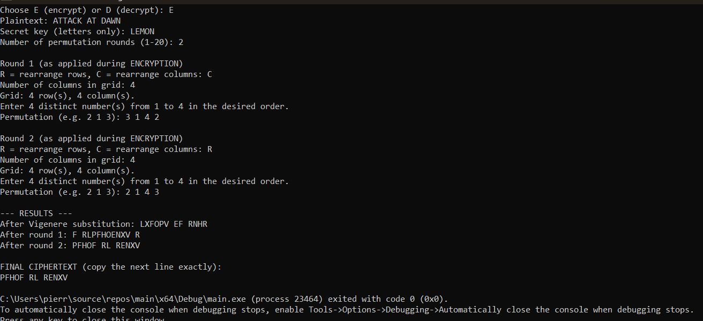
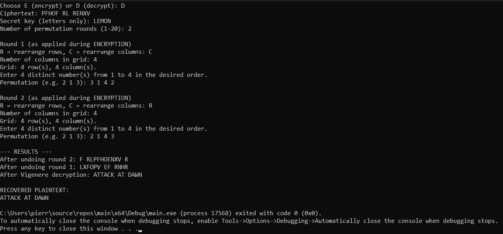

# Vigenère Cipher with Multi-Round Row and Column Permutations

**Course:** CSC316 — Homework #2  
**Language:** C++  
**Student:** Pierre Jabbour

## 1. Project Overview

This console program encrypts and decrypts text using the **Vigenère cipher**, followed by one or more **row-based or column-based permutation rounds**. During decryption, the program undoes the permutations in reverse order and then reverses the Vigenère substitution, recovering the original plaintext.

The application allows users to choose encryption (`E`) or decryption (`D`), enter a secret key, select permutation types, and specify the permutation order for each round. It displays the intermediate results and the final output.

## 2. Repository Files

```text
CSC316-HW-2-Submission-20241931-PierreJabbour/
├── Assignment 2.cpp
├── README.md
└── assets/
    ├── Encryption.png
    ├── Decryption.png
    └── assets.gitkeep
```

- **`Assignment 2.cpp`** — Complete C++ source code.
- **`README.md`** — Compilation instructions, algorithm explanation, and test cases.
- **`assets/Encryption.png`** — Console screenshot of the encryption test.
- **`assets/Decryption.png`** — Console screenshot of the successful decryption test.
- **`assets/assets.gitkeep`** — Optional placeholder file; it does not affect the program.

> **Note:** The paths and capitalization above match the filenames uploaded to this repository.

## 3. How to Compile and Run

### Option A: Microsoft Visual Studio (Windows)

1. Open **Microsoft Visual Studio** and create a **C++ Console App** project.
2. Add the code from **`Assignment 2.cpp`** to the project (or replace the contents of the project's generated `.cpp` file with it).
3. Choose **Build > Build Solution** to compile.
4. Press **Ctrl + F5** (**Start Without Debugging**) to run.
5. Follow the prompts displayed in the console.

### Option B: g++ (Windows, Linux, or macOS)

Open a terminal in the folder containing `Assignment 2.cpp` and compile it with:

```bash
g++ -std=c++17 "Assignment 2.cpp" -o vigenere
```

Run on **Windows PowerShell**:

```powershell
.\vigenere.exe
```

Run on **Linux/macOS**:

```bash
./vigenere
```

The program uses standard C++ libraries only; **no third-party libraries are required**.

## 4. How Encryption Works

1. **Vigenère substitution:** Each letter in the plaintext is shifted according to the corresponding letter of the repeating secret key (`A = 0`, `B = 1`, ..., `Z = 25`). Non-letter characters are preserved and do not consume a key character.
2. **Create a grid:** For each permutation round, arrange the current text into rows using the chosen number of columns. The last row may be incomplete; the program does not add padding.
3. **Column permutation (`C`):** Read characters **top to bottom**, taking columns in the user-specified order. For example, `3 1 4 2` reads column 3 first, then 1, then 4, then 2.
4. **Row permutation (`R`):** Read characters **left to right**, taking rows in the user-specified order. For example, `2 1 4 3` reads row 2 first, then 1, then 4, then 3.
5. **Multiple rounds:** Apply each configured permutation to the result of the previous step. The output of the last round is the final ciphertext.

The program supports **1 to 20 permutation rounds** and prints the text after Vigenère substitution and after every permutation round.

## 5. How Decryption Reverses the Process

To decrypt successfully, enter the **final ciphertext**, the **same secret key**, and the **same permutation configurations in their original encryption order**.

The program then:

1. Undoes the **last** permutation round first by returning characters to their previous positions.
2. Continues undoing each earlier permutation round in reverse sequence.
3. Applies inverse Vigenère shifts to recover the plaintext.

Because every character position is tracked and no padding is inserted, the process preserves spaces and punctuation as well as letters.

## 6. End-to-End Test Case

The following encryption and decryption use exactly the same key and permutation settings.

| Setting | Value |
| --- | --- |
| Original plaintext | `ATTACK AT DAWN` |
| Secret key | `LEMON` |
| Number of permutation rounds | `2` |
| Round 1 | Column (`C`), width `4`, order `3 1 4 2` |
| Round 2 | Row (`R`), width `4`, order `2 1 4 3` |

### Test A: Encryption

Choose **`E`**, enter the plaintext and key, then enter the two round configurations above.

**Console result:**

```text
--- RESULTS ---
After Vigenere substitution: LXFOPV EF RNHR
After round 1: F RLPFHOENXV R
After round 2: PFHOF RL RENXV

FINAL CIPHERTEXT (copy the next line exactly):
PFHOF RL RENXV
```

**Final ciphertext:** `PFHOF RL RENXV`

### Test B: Decryption

Choose **`D`**, enter ciphertext **`PFHOF RL RENXV`**, key **`LEMON`**, and the **same two round configurations** from Test A.

**Console result:**

```text
--- RESULTS ---
After undoing round 2: F RLPFHOENXV R
After undoing round 1: LXFOPV EF RNHR
After Vigenere decryption: ATTACK AT DAWN

RECOVERED PLAINTEXT:
ATTACK AT DAWN
```

**Result:** The recovered plaintext, `ATTACK AT DAWN`, is identical to the original input. This demonstrates a successful full encryption/decryption cycle with both column and row permutations.

## 7. Output Screenshots

### Encryption Screenshot



### Decryption Screenshot



## 8. Submission

This repository provides the **C++ source code**, **screenshots inside the `assets` folder**, and **README documentation**. The repository URL is submitted through **Blackboard**, as requested in the assignment instructions.

> This cipher is for learning classical cryptography and is not intended for protecting sensitive real-world information.
